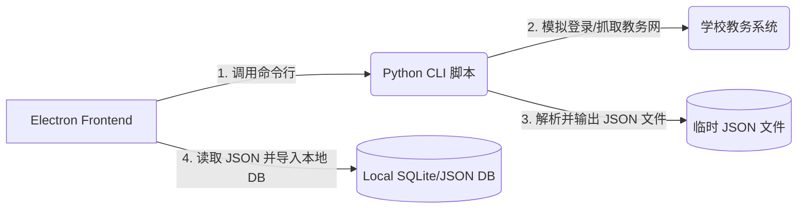

# 教务系统爬虫/新项目对接开发指南

本指南面向开发者，说明如何为本系统对接一个新的学校教务爬虫或数据源，以及爬虫与 Electron 前端主进程之间的数据接口标准。

---

## 1. 核心对接架构

本系统采用 **CLI (命令行客户端) + JSON 交换文件** 的松耦合架构。
* **前端 (Electron Main Process)**: 负责调用系统命令行，传递用户输入的账号密码及查询参数，最后读取落盘的 JSON 文件写入本地持久化数据库。
* **爬虫 (Python Crawler / Executable)**: 独立运行，负责登录学校教务网，抓取、解析数据，并按照约定的格式将结果输出为 JSON。

这种设计使得你只需修改或替换 Python 脚本，而**无需修改 Electron 主程序的渲染界面和数据库逻辑**。



---

## 2. 命令行对接契约 (CLI Contract)

如果要开发一个新项目的爬虫以供系统调用，该脚本/程序必须接受以下命令行参数：

| 参数项 | 说明 | 示例值 |
| :--- | :--- | :--- |
| `--user` | 登录账号 (如学号、工号等) | `"2023010101"` |
| `--pwd` | 登录密码 | `"MyPassword123"` |
| `--term` | 查询的目标学期，若为 `auto` 则自动解析当前学期 | `"2025-2026-1"` |
| `--mode` | 抓取模块，前端固定传入 `all` (表示同时抓取课表、考试、成绩和学期信息) | `"all"` |
| `--out` | 输出的 JSON 文件绝对路径 | `"C:\Users\Temp\data.json"` |

**调用指令示例：**
```bash
python your_new_crawler.py --user "2023010101" --pwd "MyPassword123" --term "2025-2026-1" --mode all --out "C:\path\to\output.json"
```

---

## 3. 接口数据结构示例 (Anonymized Mock JSON)

以下是符合前端解析标准的 **脱敏/模拟 JSON 数据结构示例**（可直接向老师或评审人员展示，不包含任何真实个人及学校敏感信息）：

```json
{
  "学期": "2025-2026-1",
  "学期信息": {
    "学期": "2025-2026-1",
    "当前周次": 12,
    "起始周": 1,
    "结束周": 20,
    "总周数": 20,
    "开学日期": "2025-09-01",
    "推算方法": "系统自动从教学日历解析"
  },
  "课程": [
    {
      "课程名": "高等数学 (I)",
      "星期": "星期一",
      "星期序号": 1,
      "大节": "第一大节",
      "节次": "1-2",
      "上课时间": "08:00~09:40",
      "周次": "1-16",
      "教师": "华罗庚",
      "地点": "理学楼 302 教室",
      "班级": "数学学社2501班",
      "课程编号": "MATH10001",
      "考核方式": "闭卷考试",
      "总学时": "64",
      "总人数": "120"
    },
    {
      "课程名": "大学物理实验",
      "星期": "星期三",
      "星期序号": 3,
      "大节": "第三大节",
      "节次": "5-6",
      "上课时间": "14:00~15:40",
      "周次": "2,4,6,8,10,12",
      "教师": "钱三强",
      "地点": "物理实验中心 405",
      "班级": "物理拔尖班",
      "课程编号": "PHYS10002",
      "考核方式": "考查",
      "总学时": "32",
      "总人数": "30"
    }
  ],
  "备注": [
    "生产实习 (第17-18周，指导教师：邓稼先)",
    "军事训练 (第1-2周，校操场)"
  ],
  "考试安排": [
    {
      "校区": "主校区",
      "考试校区": "主校区",
      "考试时间": "2026-01-08 09:00~11:00",
      "考场": "新教学楼 201 教室",
      "课程编号": "MATH10001",
      "课程名称": "高等数学 (I)",
      "授课教师": "华罗庚",
      "座位号": "45",
      "准考证号": "2025010145",
      "考试场次": "上午场",
      "备注": "带计算器"
    }
  ],
  "成绩": [
    {
      "开课学期": "2025-2026-1",
      "课程编号": "MATH10001",
      "课程名称": "高等数学 (I)",
      "开课单位": "数学与统计学院",
      "成绩": "95",
      "成绩标识": "正常",
      "学分": "4.0",
      "总学时": "64",
      "绩点": "4.5",
      "考核方式": "笔试",
      "考试性质": "期末考试",
      "课程属性": "必修",
      "课程性质": "公共基础课",
      "补重学期": "",
      "txklb": ""
    },
    {
      "开课学期": "2025-2026-1",
      "课程编号": "PHYS10002",
      "课程名称": "大学物理实验",
      "开课单位": "物理与电子工程学院",
      "成绩": "优秀",
      "成绩标识": "正常",
      "学分": "2.0",
      "总学时": "32",
      "绩点": "4.0",
      "考核方式": "实践考核",
      "考试性质": "期末考试",
      "课程属性": "选修",
      "课程性质": "专业基础课",
      "补重学期": "",
      "txklb": ""
    }
  ]
}
```

---

## 4. 字段映射契约 (Field Mapping)

在编写新爬虫时，应保证生成的 JSON 字段名称与下方映射一致：

### A. 课程 (Schedule)
* **`课程名`**: (必填) 课程名称字符串。
* **`星期序号`**: (必填) `1` (周一) 到 `7` (周日)。
* **`节次`**: (必填) 如 `"1-2"`、`"3-4"`、`"5-6"` 或单节 `"9"`。
* **`上课时间`**: 如 `"08:00~09:40"`。
* **`周次`**: 支持区间（如 `"1-16"`）或单周逗号分隔（如 `"2,4,6"`）。
* **`教师`** / **`地点`**: 上课教师名及上课地点。

### B. 学期信息 (Semester Info)
* **`开学日期`**: (必填) 必须是 `"YYYY-MM-DD"` 格式，前端将用该日期作为第 1 周周一，来自动计算当前显示哪一周的课表。

### C. 考试安排 (Exam)
* **`考试时间`**: 包含具体日期的日期时间字符串。
* **`考场`**: 考试物理教室。
* **`座位号`**: 考试的座位编号。

### D. 成绩 (Grade)
* **`开课学期`**: 必须与教务系统的真实学期格式一致，如 `"2025-2026-1"`。前端依靠该字段对成绩进行归类。
* **`成绩`**: 支持百分制字符串 (如 `"92"`) 或分级字符 (如 `"优秀"`, `"合格"`)。
* **`绩点`**: 计算出的绩点 (如 `"4.2"`)。

---

## 5. 新项目对接开发三步走

1. **第一步：抓包分析新学校的教务系统**
   确认该校教务系统（如强智、正方、青果、金智等）的登录接口（RSA加密/验证码处理）以及课表、成绩、考试的 API 请求。

2. **第二步：编写 Python 脚本**
   利用 `requests` 模拟请求（必要时使用 `selenium` 处理滑块/复杂认证），并实现命令行参数解析。确保最终保存的文件格式符合上面的 JSON 样例。

3. **第三步：修改 Electron 主进程加载配置**
   在主进程 `src/main/persistence/timetable.ts` 的 `importFromCrawler` 函数中，修改调用的命令行：
   ```typescript
   // 原：
   const cmd = `python hut_schedule.py --out "${tempOutPath}" --mode all${termArg}${userArg}${pwdArg}`
   
   // 修改为你的新脚本：
   const cmd = `python your_new_crawler.py --out "${tempOutPath}" --mode all${termArg}${userArg}${pwdArg}`
   ```
   如果新学校的字段存在差异，你也可以直接在 `timetable.ts` 中调整映射函数，将新字段转换为系统的标准字段。
